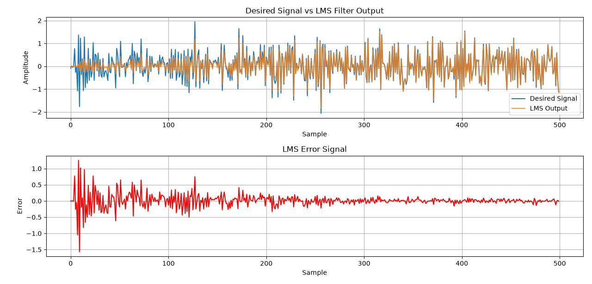

# BCA Practical Work – NLP, Neural Networks & Digital Image Processing

# LAB-AI-ML

Academic practical work and implementations covering **Natural Language Processing, Neural Networks, and Digital Image Processing**.

This repository documents my practical learning through Python programs, experiments, and supporting files completed as part of my Computer Science & applications coursework.
## Areas Covered

| Area | Folder | What you'll find |
|---|---|---|
| Natural Language Processing | [`NLP_PRACTICLE`](./NLP_PRACTICLE/) | NLP practical programs |
| Neural Networks | [`NN_PRACTICLE`](./NN_PRACTICLE/) | Neuron, perceptron, learning and neural-network practicals |
| Digital Image Processing | [`DIP`](./DIP/) | Image processing, transformations, filtering and related practicals |

This repository contains my academic practical work and implementations in three areas of Computer Science:

- **Natural Language Processing (NLP)**
- **Neural Networks (NN)**
- **Digital Image Processing (DIP)**

---

## 1. Natural Language Processing

Folder: [`NLP_PRACTICLE`](./NLP_PRACTICLE/)

The NLP section contains the practical programs completed as part of my academic coursework.

### Practical Programs

| Practical | Program |
|---|---|
| Practical 1 | [`1st_par.py`](./NLP_PRACTICLE/1st_par.py) |
| Practical 2 | [`2nd_par.py`](./NLP_PRACTICLE/2nd_par.py) |
| Practical 3 | [`3rd_par.py`](./NLP_PRACTICLE/3rd_par.py) |
| Practical 4 | [`4th_par.py`](./NLP_PRACTICLE/4th_par.py) |

---

## 2. Neural Networks

Folder: [`NN_PRACTICLE`](./NN_PRACTICLE/)

### 🧠 Neural Networks

**Status: 🔄 12/15 Practicals Completed**

A collection of practical implementations covering fundamental Neural Network
concepts and learning algorithms using Python.

| Practical | Program |
|---|---|
| 1 | [`p1_mp_neuron.py`](./NN_PRACTICLE/p1_mp_neuron.py) |
| 2 | [`p2_mp_neuron.py`](./NN_PRACTICLE/p2_mp_neuron.py) |
| 3 | [`p3_mp_neuron.py`](./NN_PRACTICLE/p3_mp_neuron.py) |
| 4 | [`p4_sl_perceptron.py`](./NN_PRACTICLE/p4_sl_perceptron.py) |
| 5 | [`p5_sl_perceptron.py`](./NN_PRACTICLE/p5_sl_perceptron.py) |
| 6 | [`p6_sl_perceptron.py`](./NN_PRACTICLE/p6_sl_perceptron.py) |
| 7 | [`p7_winner_comp.py`](./NN_PRACTICLE/p7_winner_comp.py) |
| 8 | [`p8_convergence_theory.py`](./NN_PRACTICLE/p8_convergence_theory.py) |
| 9 | [`p9_bp_ml_perceptron.py`](./NN_PRACTICLE/p9_bp_ml_perceptron.py) |
| 10 | [`p10.py`](./NN_PRACTICLE/p10.py) |
| 11 | [`p11.py`](./NN_PRACTICLE/p11.py) |
| 12 | [`p12.py`](./NN_PRACTICLE/p12.py) |
| 13 | ⏳ Remaining |
| 14 | ⏳ Remaining |
| 15 | ⏳ Remaining |

### Concepts Covered

The practical work includes concepts such as:

- McCulloch-Pitts Neuron
- Perceptron
- Single-Layer Perceptron
- Competitive / Winner-Take-All Learning
- Convergence
- Backpropagation
- Neural-network based experiments
- Image convolution

---

## 3. Digital Image Processing

Folder: [`DIP`](./DIP/)

### 🖼️ Digital Image Processing (DIP)

**Status: ✅ Practicals 1–12 Completed**

A collection of practical implementations covering fundamental Digital Image
Processing concepts using Python, OpenCV, NumPy, and Matplotlib.

| Practical | Program |
|---|---|
| 1 | [`p1_color.py`](./DIP/p1_color.py) |
| 2 | [`p2_logical.py`](./DIP/p2_logical.py) |
| 3 | [`p3_grayscale.py`](./DIP/p3_grayscale.py) |
| 4 | [`p4_hist.py`](./DIP/p4_hist.py) |
| 5 | [`p5_DFT.py`](./DIP/p5_DFT.py) |
| 6 | [`p6_v_com.py`](./DIP/p6_v_com.py) |
| 7 | [`p7_RLE.py`](./DIP/p7_RLE.py) |
| 8 | [`p8_GNP.py`](./DIP/p8_GNP.py) |
| 9 | [`p9_AMF_img.py`](./DIP/p9_AMF_img.py) |
| 10 | [`p10_wiener.py`](./DIP/p10_wiener.py) |
| 11 | [`p11Inverse.py`](./DIP/p11Inverse.py) |
| 12 | [`p12_color_hist.py`](./DIP/p12_color_hist.py) |

### Topics Covered

- Color image processing
- Logical image operations
- Grayscale conversion
- Histogram processing
- Discrete Fourier Transform
- Video compression
- Run Length Encoding
- Gaussian noise
- Adaptive Median Filtering
- Wiener filtering
- Inverse filtering
- Color histograms

### Tools & Libraries

`Python` · `OpenCV` · `NumPy` · `Matplotlib`

The folder also contains supporting images and videos used during the practical work.

---

## Technologies Used

The practicals primarily use:

- Python
- NumPy
- Matplotlib
- Pillow (PIL)

Additional libraries may be used for specific practicals.

---

## Example: Image Convolution

One of the practicals demonstrates image convolution using Python.

The program:

1. Loads an image.
2. Converts it to grayscale.
3. Represents the image as a NumPy array.
4. Applies convolution using manually defined kernels.
5. Produces different filtered outputs.

The implemented filters include:

- Blur
- Sharpen
- Edge Detection

Example output:



---

## How to Run

Clone the repository:

```bash
git clone <repository-url>
````

Navigate into the repository:

```bash
cd practicle
```

Open the folder for the subject you want to work with:

```text
NLP_PRACTICLE/
NN_PRACTICLE/
DIP/
```

Then run the required Python program.

For example:

```bash
cd NN_PRACTICLE
python p12.py
```

Install the commonly used libraries if required:

```bash
pip install numpy matplotlib pillow
```

---

## Purpose of This Repository

This repository is maintained as a record of my academic practical work and learning process.

The main goals are to:

* Understand theoretical concepts through implementation
* Practice Python programming
* Connect theory with practical applications
* Experiment with algorithms and techniques
* Document my academic progress
* Build a reference for revision and future learning

The programs are primarily intended for **learning and academic purposes**.

---

## Repository Status

**Ongoing Academic Work**

The repository may be updated as I complete, improve, or revisit practicals.

Some programs are simple implementations created specifically to understand the underlying concepts.

| Area | Progress | Status |
|---|---:|---|
| 📝 NLP | Ongoing| 🔄 |
| 🧠 Neural Networks | 12/15 | 🔄 |
| 🖼️ Digital Image Processing | 12/12 | ✅ |

### 🧠 Neural Networks

**Status: 🔄 12/15 Practicals Completed**

A collection of practical implementations covering fundamental Neural Network
concepts and learning algorithms using Python.

### 🖼️ Digital Image Processing (DIP)

**Status: ✅ Practicals 1–12 Completed**

A collection of practical implementations covering fundamental Digital Image
Processing concepts using Python, OpenCV, NumPy, and Matplotlib.

---

## Author

**Syeda Nazish**

Computer Science & applications Student

> Learning by implementing, experimenting, and documenting.

[1]: https://docs.github.com/en/repositories/managing-your-repositorys-settings-and-features/customizing-your-repository/about-readmes?source=post_page-----3517d97249d0---------------------------------------&utm_source=chatgpt.com "About the repository README file - GitHub Docs"
